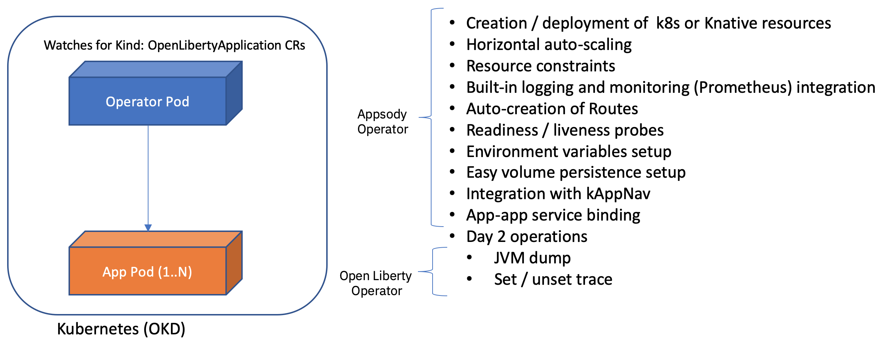
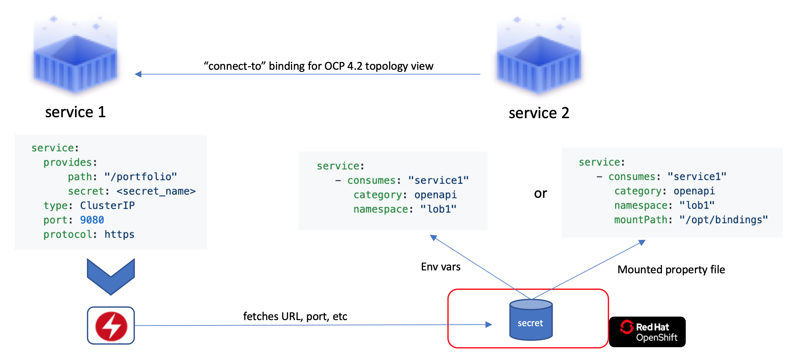
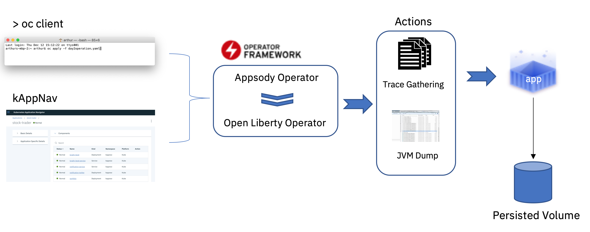
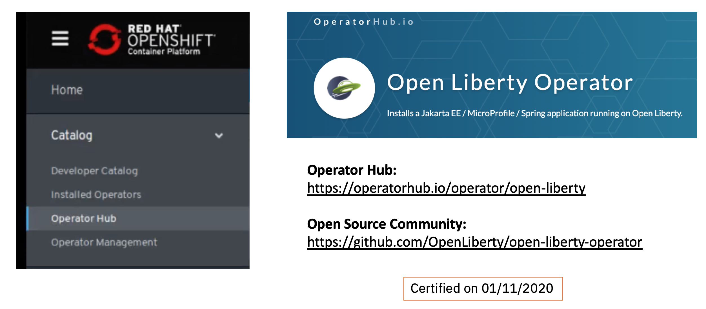
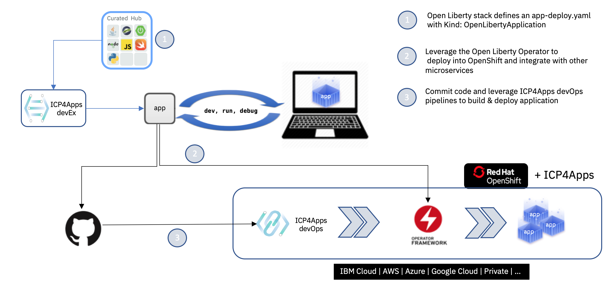

## Key Concepts / Background
- Open Liberty Operator had a `0.0.1` release in May 2019 where it wrapped around the Open Liberty Helm Chart
  -  Was enough to get the Operator checkmark and fit the requirements from a Red Hat Runtimes perspective
  -  Lacked the ability to grow beyond the deployment phase.

- The [Appsody Operator](https://github.com/appsody/appsody-operator) was re-written in version 0.2.1 to have a core library that works with a `BasicApplication` Go interface
  -  This allowed us to have the `AppsodyApplication` instance which uses that library, as well as any other runtime specific instance, such as `OpenLibertyApplication`.

- We took the Appsody Operator 0.3.0 release as the base library for the re-launch of the Open Liberty Operator, releasing version 0.3.0 to stay in-sync with its upstream library.  

## User stories
- As Champ (architect) and Todd (admin), we would like to curate a single deployment artifact with general QoS and Open Liberty specific configuration covering advanced security, transactional and operational domains.  

- As Todd and Jane (developer), we would like be able to service our Open Liberty application containers with day-2 operations that are easy to trigger and consume.

- As Champ / Todd / Jane, we would like to utilize the Open Liberty Operator as a drop-in replacement (mechanical migration) for the Appsody Operator for the Open Liberty Application Stack.

## As-is
- The Appsody Operator has very useful generic QoS and the `app-deploy.yaml` from the Open Liberty Application Stack has Liberty specific values such as using the appropriate default ports and MicroProfile endpoints.  However, it does not cover advanced Liberty scenarios such as configuring Liberty's OpenID Connect client or have Liberty specific day-2 operation such as trigger a JVM dump.  

## To-be
- A new Open Liberty Operator that builds upon everything that the Appsody Operator has and adds Liberty specific configuration and day-2 operations. 

## Main Feature design

### Relationship with Appsody Operator
Appsody Operator (upstream) --> Open Liberty Operator (downstream)

Appsody Operator Roadmap includes:
*  OpenShift Certificate Manager integration
*  Advanced service binding (resources)
*  Improved rollout support

Open Liberty Operator Roadmap includes everything from Appsody's Roadmap plus:
*  OpenID Connect client configuration injection
*  Transaction peer-recovery
*  Specialized day 2 operations

### Inherited binding

Seamless binding between apps deployed by the Appsody Operator and the Open Liberty Operator.

### Day 2 Operations

### Certified with Red Hat's OperatorHub

### Drop-in replacement for Appsody Operator within umbrella frameworks (Kabanero.io, ICP4Apps)

Needed actions to fulfill the image below:
- add new attribute to Open Liberty Application Stack's `stack.yaml` (e.g.  `operator = OpenLiberty`)
- update Open Liberty Application Stack's `app-deploy.yaml` to use `Kind: OpenLibertyApplication`
- update Appsody's CLI to either install the Open Liberty Operator or at least avoid checking for the existance of the Appsody Operator when deploying such stack
- ensure that when updating annotations / labels from `app-deploy.yaml` the Appsody's CLI does not remove extra fields from the `OpenLibertyApplication` CR.
- update the Kabanero Operator to install the Open Liberty Operator from the certified OperatorHub
- no changes needed at the devOps side, as the pipeline is agnostic of the `Kind` inside the deployed `app-deploy.yaml`

